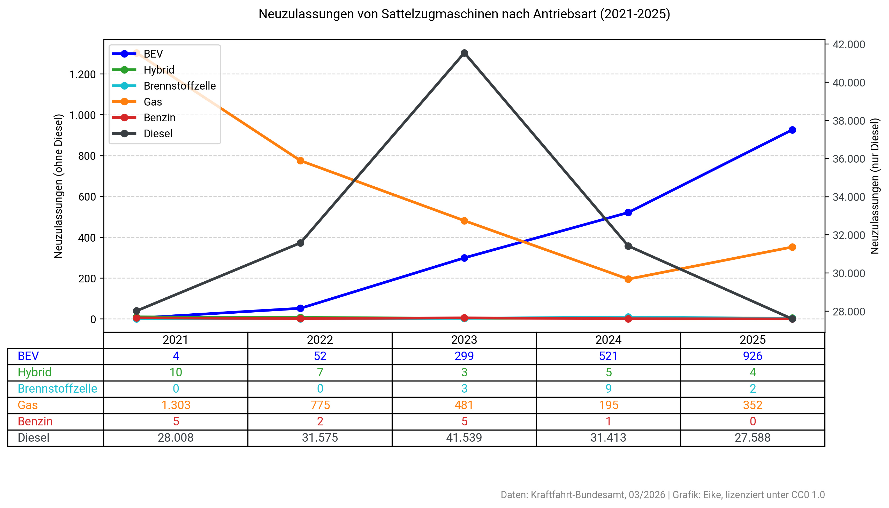

# German Truck Registration Graph

This tool generates a graph visualizing new registrations of tractor-trailers (also known as semi-trucks in the US or articulated lorries in the UK, Sattelzugmaschinen in German) in Germany, categorized by powertrain type.

The [data](data.csv) is based on [statistics](https://fragdenstaat.de/a/366520) from the German Federal Motor Transport Authority (Kraftfahrt-Bundesamt, KBA).



## Run in Colab

You can run this project directly in your browser using Google Colab. This is the easiest way to see the script in action or tweak it without any local setup.

[Open In Colab](https://colab.research.google.com/github/eik3/de-truck-registrations/blob/main/de-truck-registrations.ipynb)

## Run Locally

### Prerequisites

- Docker

#### 1. Build the Docker Image

Build the Docker image once, or whenever the code changes.

```bash
./do build
```

#### 2. Generate the Graph

```bash
./do run
```

The graph is saved as `output/neuzulassungen_sattelzugmaschinen.png`.

## License

CC0 1.0 Universal. This means the work is dedicated to the public domain, and you are free to use it for any purpose without restrictions.

## AI Transparency

This code was written with the help of Google Gemini and Claude Code.
